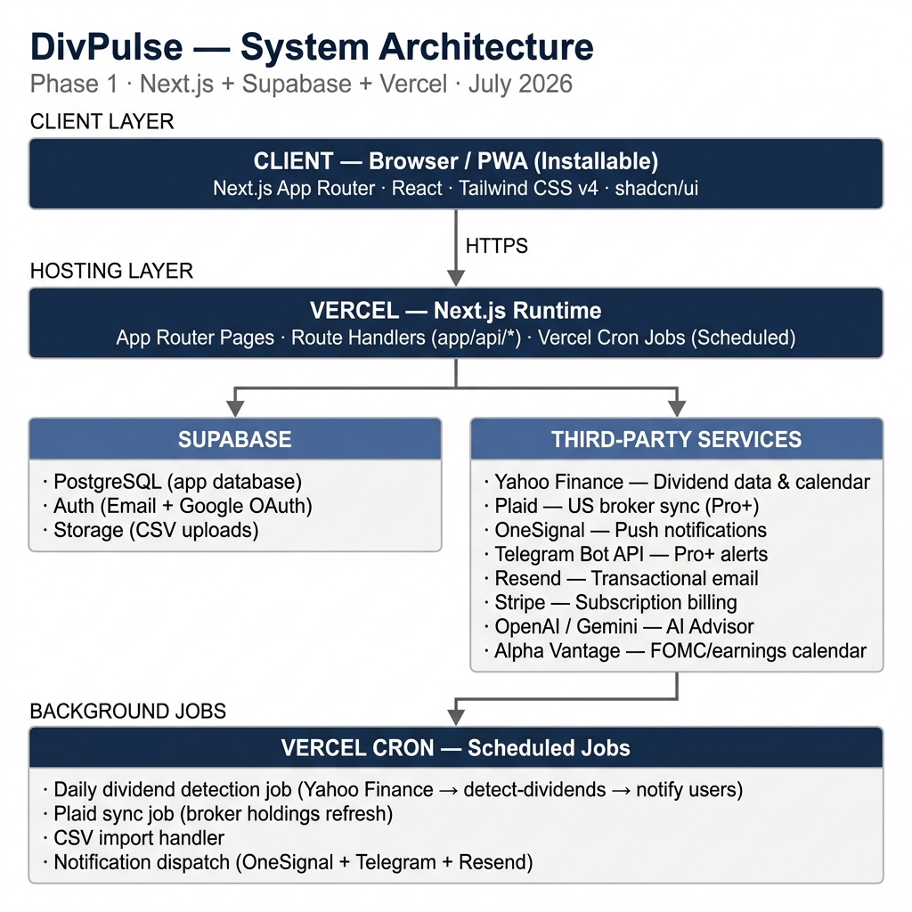

# DivPulse — Architecture Document

**Version:** 1.0
**Date:** 2026-07-15
**Status:** Living document — describes both the target architecture (derived from `PRD.md`, `services.md`, and `Prototype/`) and the actual current implementation state (Section 14). Update this file as the build progresses; do not let it drift from reality.
**Sources synthesized:** `docs/PRD.md`, `docs/services.md`, `Prototype/*.html`, `Design-System/*`, current codebase (`app/`, `components/`, `lib/`, `package.json`).

---

## 1. What DivPulse Is

DivPulse is a dividend-tracking SaaS web platform, delivered as an installable Progressive Web App (no native iOS/Android app in Phase 1). Its entire value proposition is one sentence: **the user finds out a dividend landed before their broker's own app tells them.**

Positioning (from the design system): "quiet confidence" — a serious financial tool, not a gamified consumer app. Dark-canvas UI, one restrained brand green, numbers that do the talking.

- **Client:** Welson
- **Developer:** Mohammad Shuja Uddin 
- **Delivery format:** PWA — installable on iOS/Android home screens via the browser, no App Store/Play Store distribution in Phase 1

---

## 2. Problem & Users

**Problem:** brokerage apps don't proactively notify on dividend payments — investors have to manually check. DivPulse closes that gap with real-time, cross-channel alerts (push, Telegram, email).

**Target users:**
- Dividend/income-focused retail investors
- Users on major US brokers (Fidelity, Schwab, Robinhood, IBKR, TD Ameritrade, Vanguard, Webull) — eligible for automatic Plaid sync
- Users on international/unsupported brokers, explicitly including Brazilian brokers (XP, Avenue, Nomad) — manual entry or CSV import only, no Plaid coverage

The Brazilian-broker case is not incidental: the app prototype's topbar already includes a currency switcher (USD/BRL/MXN) and language switcher (EN/PT/ES) — see Section 8. Internationalization is a real, implied requirement even though the PRD's "Core Features" table doesn't call it out explicitly.

---

## 3. Feature Inventory

| Feature | Description | Plan gate |
|---|---|---|
| Dividend Notifications | Push (OneSignal), Telegram, email the moment a dividend is detected. Three templates: ticker+amount, account balance update, broker-confirmed payout. | Push: all plans. Telegram: Pro+. |
| Dashboard ("For You") | Central view of holdings, upcoming/past dividends, account summary, today's income. | All plans |
| Holdings Tracker | Tracked assets — manual entry, CSV import, or Plaid auto-sync. | Free: 5 assets manual. Pro: unlimited manual. Pro+: + Plaid + CSV. |
| Dividend Calendar | Upcoming/historical ex-dividend and payment dates per asset; optional FOMC/earnings overlay. | All plans |
| Diversification View | Breakdown of holdings by sector, broker, asset type. | All plans |
| Collections | Curated asset groupings (REITs, High Yield, BDCs…) with live prices/yields. Admin-curated, zero user setup. | All plans |
| Watchlist | Assets tracked but not held. | All plans |
| Goals & Financial Planning | Passive income targets, emergency reserve tracking, financial-freedom milestones. | All plans |
| AI Advisor | Conversational assistant inside Goals/Diversification (e.g. "how much do I need to invest to earn $1,000/mo?"). | Pro feature (per services.md) |
| Settings | Account, notification preferences, subscription management, currency/language. | All plans |

### Subscription tiers

| Plan | Price | Asset tracking | Notifications |
|---|---|---|---|
| Free | $0 | Manual entry, up to 5 assets | Push only |
| Pro | $59/yr | Manual entry, unlimited assets | Push + Telegram |
| Pro+ | $119/yr | + Plaid auto-sync (US brokers) + CSV import (international) | Push + Telegram + priority |

---

## 4. Technology Stack

| Layer | Choice | Notes |
|---|---|---|
| Frontend framework | Next.js (App Router) | PRD specifies 14; **actual scaffold runs 16.2.10** — see Section 15 discrepancy #1. |
| Styling | Tailwind CSS v4 | `@theme inline` mapping to DivPulse design tokens; default palette reset to a closed world (see Section 13). |
| Component primitives | shadcn/ui (Radix UI) | Already integrated, re-themed to brand tokens (Section 13). |
| Fonts | Inter, Inter Tight, JetBrains Mono | Self-hosted via `next/font/google`, not the design system's CDN `@import`. |
| Database / Auth / Storage | Supabase (Postgres) | Not yet connected in code — see Section 14. |
| Hosting | Vercel | Automatic deploy on push; also the natural home for scheduled jobs (Vercel Cron). |
| Payments | Stripe | Subscription billing for Pro/Pro+; card, PayPal, PIX. |
| Push notifications | OneSignal | Free to 10k users. |
| Dividend / market data | Yahoo Finance (unofficial API) | No registration, no official SLA — flagged as a reliability risk in Section 12. |
| Broker sync (US) | Plaid | Pro+ only, read-only, ~$0.30/connected account/mo. |
| Broker sync (non-US) | CSV import / manual entry | No integration; Brazilian brokers (XP, Avenue, Nomad) unsupported by Plaid. |
| Messaging | Telegram Bot API | Pro+; requires a per-user chat-linking flow (Section 9.4), not just the single owner chat ID currently in `.env`. |
| Transactional email | Resend | Free to 3k emails/mo — welcome, password reset, payment confirmation. |
| AI Advisor | **Conflicting spec** — PRD says Google Gemini Flash, `services.md` says OpenAI (~$0.001/query) | Unresolved — see Section 15 discrepancy #2. |
| Supplementary calendar data | Alpha Vantage (free tier) or a static DivPulse-maintained list | For FOMC/earnings dates only, not core dividend data. |

---

## 5. High-Level System Architecture



> Full-resolution diagram: [`docs/architecture-diagram.png`](./architecture-diagram.png)

**Architecture summary:** DivPulse has **no standalone backend service** — Vercel-hosted Next.js Route Handlers are the entire backend surface, calling Supabase and third-party APIs directly. This matches the PRD's non-functional requirement to avoid over-engineering for current scale.

```
CLIENT (Browser / PWA)
        │ HTTPS
        ▼
VERCEL — Next.js Runtime
  • App Router pages / layouts
  • Route Handlers (app/api/*)
  • Vercel Cron (scheduled jobs)
        │                    │
        ▼                    ▼
SUPABASE                THIRD-PARTY SERVICES
  • PostgreSQL             • Yahoo Finance (dividend data)
  • Auth (email+Google)    • Plaid (US broker sync, Pro+)
  • Storage (CSV)          • OneSignal (push notifications)
                           • Telegram Bot API (Pro+ alerts)
                           • Resend (transactional email)
                           • Stripe (billing)
                           • OpenAI / Gemini (AI Advisor)
                           • Alpha Vantage (FOMC/earnings)
```

---

## 6. Information Architecture / Routing Map

Derived from `Prototype/app.html`'s sidebar (Main / Explore / Account sections) and `Prototype/divpulse-spark_2.html` (separate marketing landing). Per the design system's own screen-file-first policy (`Design-System/DESIGN-MANIFEST.json`), the landing page, auth flow, and product app are kept as distinct route groups — never merged into one screen.

| Route (proposed) | Surface | Auth | Notes |
|---|---|---|---|
| `app/(marketing)/page.tsx` → `/` | Landing page | Public | Hero, value props, pricing, proof — content from `divpulse-spark_2.html`. |
| `app/(auth)/login/page.tsx` → `/login` | Sign in | Public | Email/password, "Continue with Google", demo-mode entry (prototype has all three). |
| `app/(auth)/signup/page.tsx` → `/signup` | Sign up | Public | |
| `app/(dashboard)/dashboard/page.tsx` → `/dashboard` | "For You" home | Authenticated | Default landing post-login. |
| `app/(dashboard)/holdings/page.tsx` → `/holdings` | Holdings Tracker | Authenticated | |
| `app/(dashboard)/dividends/page.tsx` → `/dividends` | Dividend history/income | Authenticated | |
| `app/(dashboard)/calendar/page.tsx` → `/calendar` | Dividend Calendar | Authenticated | |
| `app/(dashboard)/collections/page.tsx` → `/collections` | Collections | Authenticated | |
| `app/(dashboard)/diversification/page.tsx` → `/diversification` | Diversification View | Authenticated | |
| `app/(dashboard)/watchlist/page.tsx` → `/watchlist` | Watchlist | Authenticated | |
| `app/(dashboard)/goals/page.tsx` → `/goals` | Goals & Financial Planning | Authenticated | Hosts the AI Advisor panel. |
| `app/(dashboard)/notifications/page.tsx` → `/notifications` | Notification preferences | Authenticated, Pro+ gated | Prototype badges this "PRO" in the sidebar. |
| `app/(dashboard)/settings/page.tsx` → `/settings` | Account/plan/currency/language | Authenticated | |
| `app/api/**` | Route Handlers | Mixed | See Section 9. |
| `app/manifest.ts`, `app/icon.svg`, etc. | PWA metadata | Public | **Already implemented** — see Section 14. |

`(dashboard)` routes share one layout containing the sidebar + topbar shell (logo, search, notification bell, currency/language switcher, avatar menu — all present in the prototype) and are protected by `middleware.ts` checking the Supabase session, redirecting to `/login` if absent.

---

## 7. Data Architecture (proposed Supabase/Postgres schema)

No schema exists in code yet (Section 14). This is a proposed model derived from the feature set; refine before the first migration.

| Table | Key columns | Purpose |
|---|---|---|
| `profiles` | `id (=auth.users.id)`, `email`, `display_name`, `currency`, `locale`, `plan`, `created_at` | App-level user profile layered on Supabase Auth. `currency`/`locale` back the prototype's USD/BRL/MXN and EN/PT/ES switchers. |
| `subscriptions` | `user_id`, `stripe_customer_id`, `stripe_subscription_id`, `plan (free\|pro\|pro_plus)`, `status`, `current_period_end` | Mirrors Stripe subscription state; source of truth for plan-gated feature checks. |
| `holdings` | `id`, `user_id`, `ticker`, `shares`, `broker_name`, `source (manual\|csv\|plaid)`, `plaid_account_id (nullable)`, `created_at` | User's tracked positions. Free plan capped at 5 rows, enforced at the API layer. |
| `broker_connections` | `id`, `user_id`, `plaid_item_id`, `plaid_access_token (encrypted)`, `institution_name`, `status`, `last_synced_at` | Plaid Item state, Pro+ only. Access token must be encrypted at rest per PRD §8. |
| `dividend_events` | `id`, `ticker`, `ex_date`, `pay_date`, `amount_per_share`, `source`, `fetched_at` | **Market-level cache**, not user-specific — one row per ticker/pay-date, shared across all users holding that ticker. Populated by the daily detection job (Section 9.1) from Yahoo Finance. |
| `dividend_payments` | `id`, `user_id`, `holding_id`, `dividend_event_id`, `amount (shares × amount_per_share)`, `pay_date`, `notified_at`, `notified_channels[]` | Per-user realized payout log — dashboard history + notification dedup ledger. |
| `watchlist_items` | `id`, `user_id`, `ticker`, `added_at` | |
| `collections` | `id`, `name`, `category`, `description` | Admin-curated, not user-writable. |
| `collection_tickers` | `collection_id`, `ticker` | Many-to-many: which tickers belong to which curated collection (e.g. `JEPI → High Yield`, `O → REITs`). |
| `goals` | `id`, `user_id`, `goal_type (passive_income\|emergency_reserve\|financial_freedom)`, `target_amount`, `target_date`, `monthly_contribution` | |
| `notification_preferences` | `user_id`, `push_enabled`, `telegram_chat_id (nullable)`, `telegram_enabled`, `email_enabled` | `telegram_chat_id` is per-user, captured via the linking flow in Section 9.4 — distinct from the single `TELEGRAM_OWNER_CHAT_ID` dev credential in `services.md`. |
| `notification_log` | `id`, `user_id`, `channel`, `template`, `payload`, `sent_at`, `status` | Audit trail; backs the PRD's "no missed notifications on service restarts" reliability requirement (a restart replays from last-processed state instead of trusting in-memory queues). |
| `ai_advisor_queries` | `id`, `user_id`, `prompt`, `response`, `created_at`, `cost_estimate` | Usage log for the pay-per-query AI provider — needed for cost control regardless of which provider wins (see discrepancy #2). |

**Row-Level Security:** every user-scoped table needs Supabase RLS policies restricting reads/writes to `auth.uid() = user_id`. `dividend_events` and `collections`/`collection_tickers` are the exceptions — shared reference data, service-role-write-only, public read (or read via API only, per your data-exposure preference).

---

## 8. Internationalization

Not in the PRD's feature table, but present throughout the prototype's topbar (`ax-cr` currency selector: USD/BRL/MXN; `ax-cr` language selector: EN/PT/ES) and consistent with the Brazilian-broker support called out in `services.md` §6. Treat as a real requirement:

- Currency: display conversion only (holdings/dividends are tracked in native currency; the switcher changes display formatting, not stored values) unless the client confirms multi-currency portfolios are needed.
- Locale: EN/PT/ES UI strings — needs an i18n library decision (e.g. `next-intl`) before any page copy is hard-coded in English, since retrofitting i18n after the fact is expensive.

Flag this with the client explicitly — it changes how early you need to structure copy/strings.

---

## 9. Backend Architecture — Route Handlers & Jobs

### 9.1 Dividend detection job (the core value prop)

This is the single most important piece of backend architecture — it's the entire product's reason to exist.

```
Vercel Cron (daily, e.g. 06:00 UTC + intraday re-checks near known pay dates)
   → POST /api/jobs/detect-dividends   (protected by a cron secret header)
      1. SELECT DISTINCT ticker FROM holdings
      2. For each ticker: fetch dividend data from Yahoo Finance
      3. Upsert new rows into dividend_events (ticker, ex_date, pay_date, amount_per_share)
      4. For each dividend_event where pay_date = today AND not already in dividend_payments:
           for each holding matching that ticker:
             - insert dividend_payments (amount = shares × amount_per_share)
             - enqueue notification (push always; telegram/email per user prefs + plan)
      5. Write notification_log rows as each channel send completes/fails
```

Reliability requirements from the PRD ("no missed notifications on service restarts") mean this must be **idempotent and resumable** — re-running the job must not double-notify (guarded by the `dividend_payments` unique constraint on `(holding_id, dividend_event_id)`), and a crash mid-run must be recoverable by re-running rather than requiring manual intervention. A durable queue (Supabase table as a poor-man's queue, or a proper queue like Vercel Queue/Inngest/QStash if volume grows) is worth planning for once user count makes a single serverless function's timeout a real constraint — not needed at Phase-1 scale.

### 9.2 Broker sync (Plaid)

- `POST /api/plaid/link-token` — create a Plaid Link token for the client-side Link flow (Pro+ only)
- `POST /api/plaid/exchange-token` — exchange public token for access token, store encrypted in `broker_connections`
- `POST /api/jobs/sync-plaid-holdings` — scheduled (or webhook-triggered via Plaid's own webhooks) sync of holdings from connected accounts into `holdings`

### 9.3 CSV import

- `POST /api/holdings/import-csv` — Pro+, accepts an uploaded file (Supabase Storage or direct multipart), parses broker-specific export formats (XP, Avenue, Nomad at minimum per `services.md`), inserts `holdings` rows with `source = 'csv'`.

### 9.4 Telegram linking

`services.md` only documents a single `TELEGRAM_OWNER_CHAT_ID` — that's a developer/admin alert channel, not the per-user delivery mechanism the PRD describes ("Telegram alerts... the moment a dividend is detected" as a Pro+ user-facing feature). A real per-user flow is needed:
1. User clicks "Connect Telegram" in Settings → shown a deep link to the bot with a unique linking code
2. User sends `/start <code>` to the bot
3. Bot webhook (`POST /api/telegram/webhook`) captures the resulting `chat_id`, matches it to the linking code, writes it to `notification_preferences.telegram_chat_id`

### 9.5 Stripe billing

- `POST /api/stripe/checkout` — create Checkout Session for Pro/Pro+
- `POST /api/stripe/webhook` — handle `checkout.session.completed`, `customer.subscription.updated/deleted` to keep `subscriptions` in sync (source of truth for plan gating everywhere else in the app)
- `POST /api/stripe/portal` — Stripe Customer Portal session for self-serve upgrade/downgrade/cancel

### 9.6 AI Advisor

- `POST /api/advisor/query` — server-side call to the chosen provider (resolve discrepancy #2 first), rate-limited per plan, logged to `ai_advisor_queries` for cost tracking

---

## 10. Authentication & Authorization

- **Provider:** Supabase Auth — email/password + Google OAuth (both present in the prototype's login screen), plus a "demo mode" entry point for prospects to explore without an account.
- **Session handling:** Supabase's SSR helpers (`@supabase/ssr`) with Next.js middleware refreshing the session cookie on each request.
- **Route protection:** `middleware.ts` redirects unauthenticated requests away from `(dashboard)` routes to `/login`.
- **Plan gating:** a single source of truth — `subscriptions.plan` (kept in sync by the Stripe webhook) — checked both server-side (Route Handlers reject over-plan actions, e.g. a 6th manual holding on Free) and client-side (UI shows upgrade prompts, matching the prototype's "PRO" sidebar badges). Never trust a client-side check alone for anything that gates cost (Plaid connections, AI queries, Telegram sends).

---

## 11. Third-Party Integration Summary

| # | Service | Registration | Cost | Powers |
|---|---|---|---|---|
| 1 | Supabase | supabase.com | Free | DB, auth, storage |
| 2 | Vercel | vercel.com | Free | Hosting, cron |
| 3 | OneSignal | onesignal.com | Free ≤10k users | Push notifications |
| 4 | Stripe | stripe.com | Free + tx % | Subscriptions |
| 5 | Yahoo Finance | none | Free, unofficial | Dividend data, calendar, collections pricing |
| 6 | Plaid | plaid.com/developers | ~$0.30/account/mo | US broker auto-sync (Pro+) |
| 7 | Telegram Bot API | pre-configured | Free | Pro+ alerts |
| 8 | Resend | resend.com | Free ≤3k emails/mo | Welcome, password reset, payment confirmation |
| 9 | Gemini or OpenAI | — | Gemini free tier / OpenAI ~$0.001/query | AI Advisor — **provider unresolved, see discrepancy #2** |
| — | Alpha Vantage | alphavantage.co | Free tier | Optional FOMC/earnings calendar overlay |

Required environment variables (union of the above, names inferred from convention — confirm exact names when each integration is wired up):

```
NEXT_PUBLIC_SUPABASE_URL
NEXT_PUBLIC_SUPABASE_ANON_KEY
SUPABASE_SERVICE_ROLE_KEY
STRIPE_SECRET_KEY
STRIPE_WEBHOOK_SECRET
NEXT_PUBLIC_STRIPE_PUBLISHABLE_KEY
ONESIGNAL_APP_ID
ONESIGNAL_REST_API_KEY
PLAID_CLIENT_ID
PLAID_SECRET
PLAID_ENV
TELEGRAM_BOT_TOKEN
TELEGRAM_OWNER_CHAT_ID        # dev/admin alerts only, not per-user delivery
RESEND_API_KEY
GEMINI_API_KEY or OPENAI_API_KEY   # pending discrepancy #2
ALPHA_VANTAGE_API_KEY          # optional
CRON_SECRET                    # protects /api/jobs/* from unauthenticated invocation
```

`TELEGRAM_BOT_TOKEN` is already flagged as a live credential in `services.md` — confirm it's never committed and lives only in Vercel's environment variable store / `.env.local` (gitignored).

---

## 12. Non-Functional Requirements & Risks

From PRD §8–9, plus risks surfaced during this synthesis:

| Requirement | Implication |
|---|---|
| Read-only broker access, no funds movement | Plaid integration must request read-only products only (`investments`, not `transfer`/`payment`). |
| Encrypted data at rest and in transit | Supabase gives TLS in transit by default; `broker_connections.plaid_access_token` needs explicit column-level encryption or a KMS-backed secrets approach, not plain storage. |
| Secure server-side API key storage | All third-party secrets live in Vercel env vars, never exposed to the client bundle (only `NEXT_PUBLIC_*` values are). |
| Least-privilege access | Supabase RLS on every user table (Section 7); service-role key used only in trusted server contexts (Route Handlers, cron jobs), never client-side. |
| No missed notifications on restart | Detection job must be idempotent/resumable (Section 9.1) — this is a correctness requirement, not just a nice-to-have. |
| Not over-engineered for current scale | No message broker, no dedicated backend service, no multi-region setup in Phase 1 — Vercel + Supabase is sufficient until traffic says otherwise. |
| **Risk (new):** Yahoo Finance is unofficial | No published SLA, rate limits, or ToS guarantee. The entire notification value proposition depends on this feed. Worth a documented fallback plan (e.g., a paid data provider swap-in point) even if not built in Phase 1 — isolate the data-fetch behind one module so swapping providers later doesn't touch the detection/notification logic. |
| **Risk (new):** AI Advisor cost | Both candidate providers are pay-per-use or rate-limited free tier. `ai_advisor_queries` logging (Section 7) plus a per-plan rate limit is needed before this ships, not after. |

Explicitly out of scope for Phase 1 (PRD §9): native mobile apps, real money movement/trading, full observability stack (distributed tracing/log aggregation), SEO/AEO/analytics/search console.

---

## 13. Frontend & Design System Architecture (implemented)

Unlike the sections above, this part is **already built**, not proposed. Three layers, each with a distinct job:

1. **Token layer** (`app/globals.css` `:root`) — DivPulse's canonical design tokens (colors, spacing, radii, type scale) copied verbatim from `Design-System/colors_and_type.css`/`kit/tokens.css`, plus a `--role-*` semantic aliasing layer.
2. **Tailwind theme mapping** (`app/globals.css` `@theme inline`) — exposes those tokens as Tailwind utilities (`bg-canvas`, `text-text-secondary`, `rounded-card`, `gap-sp-3`, etc.). The default Tailwind color palette is **fully reset** (`--color-*: initial`) so undocumented colors like `bg-blue-500` can't silently appear — DivPulse is a closed-world palette by design-system mandate.
3. **Component kit** (`app/kit.css`) — the approved, preserved production component classes (`.btn`, `.badge`, `.holding-card`, `.receipt`, `.state-card`) ported verbatim from `Design-System/kit/components.css`. Prefer these over inventing new component styles.

**shadcn/ui** is integrated on top (Radix primitives + `class-variance-authority`), with every shadcn CSS variable (`--primary`, `--background`, `--destructive`, `--ring`, etc.) remapped to the same DivPulse tokens rather than shadcn's light-mode defaults — see `app/globals.css` for the full mapping and the "closed-world" rationale repeated there. Use shadcn primitives for structural components the kit doesn't cover (Dialog, Dropdown, Sheet, Select); use kit.css classes for anything it already defines.

**Fonts** are self-hosted via `next/font/google` (Inter, Inter Tight, JetBrains Mono, variable weight) rather than the design system's CDN `@import`, per `Design-System/DESIGN.md` §11's own production recommendation.

**Dark-only:** no `prefers-color-scheme` handling exists or should be added without the same evidence-gathering rigor the design system used for the dark palette (`Design-System/DESIGN.md` §10).

**Logo & PWA icons:** fully configured — `app/favicon.ico`, `app/icon.svg`, `app/apple-icon.png`, `app/manifest.ts` (name, theme_color `#064E3B`, background_color `#0A0E0D`, full + maskable icon variants), all regenerable from `public/logo.png` via `scripts/generate-icons.mjs`. The canonical logo source also lives in `Design-System/assets/`.

---

## 14. Current Implementation Status

Be honest about this — most of the document above is target architecture, not built yet.

**Built:**
- Next.js 16 App Router scaffold, TypeScript, Tailwind v4
- Full design-token / Tailwind-theme / kit.css three-layer styling system (Section 13)
- shadcn/ui integrated and re-themed
- Logo, favicons, PWA manifest, viewport theming
- A single placeholder home page (`app/page.tsx`) demonstrating the theme — not a real dashboard

**Not started:**
- Supabase project connection (no `@supabase/*` dependency installed yet)
- Authentication (no login/signup pages, no middleware)
- Any of the 10 product routes in Section 6 beyond the placeholder home page
- Data layer / schema (Section 7 is a proposal, not a migration)
- All backend Route Handlers (Section 9)
- All third-party integrations (Section 11) — zero API clients installed
- Stripe billing, plan gating
- i18n (Section 8)
- The marketing landing page as a distinct route (currently only exists as a static prototype file)

In short: the **foundation and design system are production-grade; the product itself has not been started.**

---

## 15. Open Items

### Resolved

- **`README.md`** was the unmodified `create-next-app` default — replaced with real project documentation (setup, env vars, architecture pointer).

### Developer decisions (engineering call, no client input needed)

1. **Next.js version.** PRD §7 specifies Next.js 14; the actual scaffold is 16.2.10 (confirmed via `package.json`, and `AGENTS.md` explicitly warns this version has breaking API/convention changes from what most training data assumes). Keeping 16 — already invested, actively maintained.
2. **AI Advisor provider — to be decided.** PRD §7 says Google Gemini Flash; `services.md` §9 says OpenAI. These aren't interchangeable (different SDKs, pricing models, and quality characteristics), but the choice doesn't change what the client sees, so it's an engineering decision to finalize before `/api/advisor/query` is written, not a client question.

### Needs client confirmation

See the client-facing questions note for the two open scope questions (Telegram delivery mechanism, currency/locale switching) that do need Welson's input before implementation.

---

## 16. Suggested Build Sequence

A rough phase order, not a committed roadmap — reprioritize against actual client deadlines:

1. **Data + auth foundation** — Supabase project, `profiles`/`subscriptions` tables, RLS, Supabase Auth wired into `middleware.ts`, login/signup pages.
2. **Holdings core loop** — manual holdings CRUD, dashboard, dividend history display (no live data yet — seed/mock).
3. **Dividend detection pipeline** — Yahoo Finance integration, `dividend_events`/`dividend_payments`, the daily cron job, OneSignal push (the core value prop — ship this before anything else user-facing beyond the basics).
4. **Billing** — Stripe Checkout/Portal/webhooks, plan gating enforcement.
5. **Calendar, Diversification, Collections, Watchlist, Goals** — mostly read views over data already flowing from steps 2–3.
6. **Pro+ features** — Plaid sync, CSV import, Telegram linking + alerts.
7. **AI Advisor** — once the provider decision (discrepancy #2) is made.
8. **i18n** (if confirmed in scope) — should land as early as feasible once confirmed, since retrofitting is expensive; listed late here only because it's pending a scope decision.
9. **Landing page** as its own route, polish pass, launch checklist (SEO/analytics — explicitly deferred per PRD §9, but worth a pre-launch pass).
