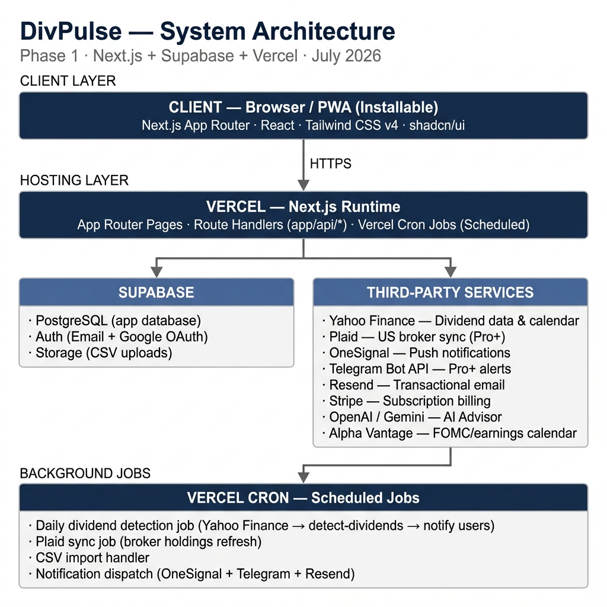

# PaidPrime — Architecture Document

**Version:** 1.1
**Date:** 2026-07-15 (Sections 4, 6, 7, 9.4, 11, 14, 15, 16 refreshed 2026-09-06 against the live codebase — everything else is unchanged from the original target-architecture draft and may still describe intent rather than fact where not called out below)
**Status:** Living document — describes both the target architecture (derived from `PRD.md`, `services.md`, and `Prototype/`) and the actual current implementation state (Section 14). Update this file as the build progresses; do not let it drift from reality. As of this refresh, most of Sections 5–13 describe features that are now **built**, not proposed — treat "proposed"/target framing in unreviewed sections with suspicion and verify against code before trusting it.
**Sources synthesized:** `docs/PRD.md`, `docs/services.md`, `Prototype/*.html`, `Design-System/*`, current codebase (`app/`, `components/`, `lib/`, `package.json`, `.env`, `supabase/migrations/`).

---

## 1. What PaidPrime Is

PaidPrime is a dividend-tracking SaaS web platform, delivered as an installable Progressive Web App (no native iOS/Android app in Phase 1). Its entire value proposition is one sentence: **the user finds out a dividend landed before their broker's own app tells them.**

Positioning (from the design system): "quiet confidence" — a serious financial tool, not a gamified consumer app. Dark-canvas UI, one restrained brand green, numbers that do the talking.

- **Client:** Welson
- **Developer:** Mohammad Shuja Uddin 
- **Delivery format:** PWA — installable on iOS/Android home screens via the browser, no App Store/Play Store distribution in Phase 1

---

## 2. Problem & Users

**Problem:** brokerage apps don't proactively notify on dividend payments — investors have to manually check. PaidPrime closes that gap with real-time, cross-channel alerts (push, Telegram, email).

**Target users:**
- Dividend/income-focused retail investors
- Users on major US brokers (Fidelity, Schwab, Robinhood, IBKR, TD Ameritrade, Vanguard, Webull) — eligible for automatic Plaid sync
- Users on international/unsupported brokers, explicitly including Brazilian brokers (XP, Avenue, Nomad) — manual entry or CSV import only, no Plaid coverage

The Brazilian-broker case is not incidental: the app prototype's topbar already includes a currency switcher (USD/BRL/MXN) and language switcher (EN/PT/ES) — see Section 8. Internationalization is a real, implied requirement even though the PRD's "Core Features" table doesn't call it out explicitly.

---

## 3. Feature Inventory

| Feature | Description | Plan gate |
|---|---|---|
| Dividend Notifications | Push (OneSignal), Telegram, email the moment a dividend is detected. Three templates: ticker+amount, account balance update, broker-confirmed payout. | Push: all plans. Telegram: Pro+. |
| Dashboard ("For You") | Central view of holdings, upcoming/past dividends, account summary, today's income. | All plans |
| Holdings Tracker | Tracked assets — manual entry, CSV import, or Plaid auto-sync. | Free: 5 assets manual. Pro: unlimited manual. Pro+: + Plaid + CSV. |
| Dividend Calendar | Upcoming/historical ex-dividend and payment dates per asset; optional FOMC/earnings overlay. | All plans |
| Diversification View | Breakdown of holdings by sector, broker, asset type. | All plans |
| Collections | Curated asset groupings (REITs, High Yield, BDCs…) with live prices/yields. Admin-curated, zero user setup. | All plans |
| Watchlist | Assets tracked but not held. | All plans |
| Goals & Financial Planning | Passive income targets, emergency reserve tracking, financial-freedom milestones. | All plans |
| AI Advisor | Conversational assistant reachable from a floating launcher on every dashboard page (e.g. "how much do I need to invest to earn $1,000/mo?"), aware of the page currently open. | Pro feature (per services.md) |
| Settings | Account, notification preferences, subscription management, currency/language. | All plans |

### Subscription tiers

| Plan | Price | Asset tracking | Notifications |
|---|---|---|---|
| Free | $0 | Manual entry, up to 5 assets | Push only |
| Pro | $59/yr | Manual entry, unlimited assets | Push + Telegram |
| Pro+ | $119/yr | + Plaid auto-sync (US brokers) + CSV import (international) | Push + Telegram + priority |

---

## 4. Technology Stack

| Layer | Choice | Notes |
|---|---|---|
| Frontend framework | Next.js (App Router) | PRD specifies 14; **actual scaffold runs 16.2.10** — see Section 15 discrepancy #1. |
| Styling | Tailwind CSS v4 | `@theme inline` mapping to PaidPrime design tokens; default palette reset to a closed world (see Section 13). |
| Component primitives | shadcn/ui (Radix UI) | Already integrated, re-themed to brand tokens (Section 13). |
| Fonts | Inter, Inter Tight, JetBrains Mono | Self-hosted via `next/font/google`, not the design system's CDN `@import`. |
| Database / Auth / Storage | Supabase (Postgres) | **Built** — 20 migrations as of 2026-08-23 (`supabase/migrations/`), RLS on every user-scoped table. See Section 14. |
| Hosting | Vercel | Live at paidprime.com. Automatic deploy on push; also runs the scheduled jobs (Vercel Cron / `pg_cron`). |
| Payments | Stripe | **Built** — Checkout, Customer Portal, and webhook-driven plan sync (`app/api/stripe/*`, `app/api/webhooks/stripe/`) for Free/Pro/Pro+. |
| Push notifications | **Firebase Cloud Messaging** (not OneSignal) | OneSignal was integrated first, then replaced entirely 2026-07-23 — see `docs/scope-comparison.md` §C. `firebase`/`firebase-admin` in `package.json`, `NEXT_PUBLIC_FIREBASE_*` + `FIREBASE_SERVICE_ACCOUNT_JSON` in `.env`, logic in `lib/firebase/`. The `ONESIGNAL_*` env vars are vestigial — `docs/services.md` is stale on this point, do not trust its push-notification section. |
| Dividend / market data | Yahoo Finance (unofficial API) | **Built** — `lib/tickers/enrich.ts` and friends. No registration, no official SLA — flagged as a reliability risk in Section 12. |
| Broker sync (US) | Plaid | **Built and live in production** (cutover 2026-08-22). Pro+ only, read-only. Individual institutions are gated by Plaid's own per-institution registration, independent of the app's production access — as of ~2026-09-06 some major brokers are still pending on Plaid's side. `.env` locally runs `PLAID_ENV=sandbox`; Vercel's production env is `PLAID_ENV=production` (client-managed, not in this repo's `.env`). |
| Broker sync (non-US) | CSV import / manual entry | **Built** — `lib/csv/`, `importHoldingsFromCsv` server action in `app/(dashboard)/holdings/actions.ts` (a Server Action, not a separate Route Handler as Section 9.3 originally proposed). Brazilian brokers (XP, Avenue, Nomad) unsupported by Plaid. |
| Messaging | Telegram Bot API | **Built** — per-user chat-linking flow implemented (`lib/telegram/`, `app/api/telegram/webhook/`, `telegram_links` migration, `components/dashboard/telegram-connect-card.tsx`), matching Section 9.4's original proposal. Pro+. |
| Transactional email | Resend | **Built** — `lib/resend/`. Free to 3k emails/mo — welcome, password reset, payment confirmation. |
| Ticker/company logos | Logo.dev (+ a static domain map) | **Not in the original service list — added since.** `lib/tickers/logo.ts`, `NEXT_PUBLIC_LOGO_DEV_KEY`. Two-source resolution: a static issuer→domain map first, Logo.dev as fallback (after Clearbit's logo API was found shut down). Not documented in `docs/services.md` — worth adding there. |
| Charting (ticker detail pages) | `lightweight-charts` | Client library, not a service — used on `/tickers/[ticker]` for the price chart. Everything else (sparklines, income bar chart) stays hand-rolled SVG per the design system's anti-bloat stance. |
| AI Advisor | PRD said Google Gemini Flash, `services.md` said OpenAI (~$0.001/query) | **Resolved and implemented: OpenAI `gpt-4o-mini`** via a plain `fetch` (`lib/advisor/openai.ts`, `app/api/advisor/query/`) — see Section 15 decision #2. Dormant in this environment: `OPENAI_API_KEY` is not currently set, so the route returns 503. |
| Supplementary calendar data | Alpha Vantage (free tier) or a static PaidPrime-maintained list | Still **not built** — no `ALPHA_VANTAGE_API_KEY` in `.env`. Calendar likely relies on Yahoo's own ex-date/pay-date fields only; FOMC/earnings overlay remains an open item. |

---

## 5. High-Level System Architecture



> Full-resolution diagram: [`docs/architecture-diagram.png`](./architecture-diagram.png)

**Architecture summary:** PaidPrime has **no standalone backend service** — Vercel-hosted Next.js Route Handlers are the entire backend surface, calling Supabase and third-party APIs directly. This matches the PRD's non-functional requirement to avoid over-engineering for current scale.

```
CLIENT (Browser / PWA)
        │ HTTPS
        ▼
VERCEL — Next.js Runtime
  • App Router pages / layouts
  • Route Handlers (app/api/*)
  • Vercel Cron (scheduled jobs)
        │                    │
        ▼                    ▼
SUPABASE                THIRD-PARTY SERVICES
  • PostgreSQL             • Yahoo Finance (dividend data)
  • Auth (email+Google)    • Plaid (US broker sync, Pro+)
  • Storage (CSV)          • OneSignal (push notifications)
                           • Telegram Bot API (Pro+ alerts)
                           • Resend (transactional email)
                           • Stripe (billing)
                           • OpenAI (AI Advisor)
                           • Alpha Vantage (FOMC/earnings)
```

---

## 6. Information Architecture / Routing Map

Originally derived from `Prototype/app.html`'s sidebar and `Prototype/paidprime-spark_2.html`. **Refreshed 2026-09-06 against the actual `app/` tree** — the real route list grew well beyond this doc's original 10 proposed routes; every route below exists in code today unless marked otherwise.

| Route | Surface | Auth | Notes |
|---|---|---|---|
| `app/page.tsx` → `/` | Marketing homepage | Public | Full site — hero, broker connections, dividend alerts, product sections, pricing, FAQ, waitlist CTA. Has swapped places with `app/homepage/page.tsx` more than once as launch timing changed (see `docs/SESSION_HANDOFF.md`); this row reflects **as of 2026-09-06**. |
| `app/homepage/page.tsx` → `/homepage` | Archived "coming soon" gate | Public, unlinked | Not the live homepage right now — kept rather than deleted. Check which of `/` and `/homepage` is actually live before assuming this table is current; it has flipped before. |
| `app/(auth)/login/page.tsx` → `/login` | Sign in | Public | |
| `app/(auth)/signup/page.tsx` → `/signup` | Sign up | Public | |
| `app/(auth)/onboarding/page.tsx` → `/onboarding` | Post-signup onboarding | Public/transitional | Not in the original proposal. |
| `app/(dashboard)/dashboard/page.tsx` → `/dashboard` | "For You" home | Authenticated | Default landing post-login. |
| `app/(dashboard)/holdings/page.tsx` → `/holdings` | Holdings Tracker | Authenticated | |
| `app/(dashboard)/dividends/page.tsx` → `/dividends` | Dividend history/income | Authenticated | |
| `app/(dashboard)/calendar/page.tsx` → `/calendar` | Dividend Calendar | Authenticated | |
| `app/(dashboard)/collections/page.tsx` → `/collections` | Collections | Authenticated | |
| `app/(dashboard)/diversification/page.tsx` → `/diversification` | Diversification View | Authenticated | |
| `app/(dashboard)/watchlist/page.tsx` → `/watchlist` | Watchlist | Authenticated | |
| `app/(dashboard)/goals/page.tsx` → `/goals` | Goals & Financial Planning | Authenticated | |
| `app/(dashboard)/notifications/page.tsx` → `/notifications` | Notification preferences | Authenticated | |
| `app/(dashboard)/settings/page.tsx` → `/settings` | Account/plan/billing | Authenticated | |
| `app/(dashboard)/brokers/page.tsx` → `/brokers` | Broker connections (Plaid) | Authenticated, Pro+ gated | Not in the original proposal — dedicated page for connect/reconnect/disconnect/resync, separate from the inline Auto-sync entry points on Holdings/Dashboard. |
| `app/(dashboard)/advisor/page.tsx` → `/advisor` | AI Advisor | Authenticated | Not in the original proposal as a standalone route — also reachable via the floating launcher described below. |
| `app/(dashboard)/analytics/page.tsx` → `/analytics` | Portfolio analytics | Authenticated | Not in the original proposal. |
| `app/(dashboard)/performance/page.tsx` → `/performance` | Portfolio performance | Authenticated | Not in the original proposal. |
| `app/(dashboard)/tickers/[ticker]/page.tsx` → `/tickers/[ticker]` | Per-ticker detail (price chart, key stats) | Authenticated | Not in the original proposal — added per `docs/scope-comparison.md` §G. |
| `app/(dashboard)/upcoming/page.tsx` → `/upcoming` | Upcoming payments | Authenticated | Not in the original proposal. |
| `app/(dashboard)/history/page.tsx` → `/history` | Historical activity | Authenticated | Not in the original proposal. |
| `app/(dashboard)/alert-templates/page.tsx` → `/alert-templates` | Notification style/template picker | Authenticated | Not in the original proposal. |
| `app/(dashboard)/help/page.tsx` → `/help` | Help/support | Authenticated | Not in the original proposal. |
| `app/(dashboard)/layout.tsx` | App shell (sidebar/topbar/bottom nav) | Authenticated | Mounts the AI Advisor's floating launcher, present on every route under `(dashboard)` so the conversation survives client-side navigation. |
| `app/api/**` | Route Handlers | Mixed | See Section 9. |
| `app/manifest.ts`, `app/icon.svg`, etc. | PWA metadata | Public | Implemented — see Section 14. |

`(dashboard)` routes share one layout containing the sidebar + topbar shell and are protected by `proxy.ts` (Next.js 16's replacement for `middleware.ts`) checking the Supabase session, redirecting to `/login` if absent — not `middleware.ts` as originally proposed here; that file doesn't exist in this Next.js version.

---

## 7. Data Architecture (Supabase/Postgres schema)

**Built** — this was a proposed model when first written; 20 migrations now exist in `supabase/migrations/` (2026-07-17 through 2026-08-23). The table below is the *original proposal* and has not been individually verified column-by-column against every migration since — Section 9.4 already documents one confirmed divergence (Telegram linking uses a dedicated `telegram_links` table, not a `notification_preferences.telegram_chat_id` column). Treat this table as directionally right but check the actual migration file before writing code against a specific column.

| Table | Key columns | Purpose |
|---|---|---|
| `profiles` | `id (=auth.users.id)`, `email`, `display_name`, `currency`, `locale`, `plan`, `created_at` | App-level user profile layered on Supabase Auth. `currency`/`locale` back the prototype's USD/BRL/MXN and EN/PT/ES switchers. |
| `subscriptions` | `user_id`, `stripe_customer_id`, `stripe_subscription_id`, `plan (free\|pro\|pro_plus)`, `status`, `current_period_end` | Mirrors Stripe subscription state; source of truth for plan-gated feature checks. |
| `holdings` | `id`, `user_id`, `ticker`, `shares`, `broker_name`, `source (manual\|csv\|plaid)`, `plaid_account_id (nullable)`, `created_at` | User's tracked positions. Free plan capped at 5 rows, enforced at the API layer. |
| `broker_connections` | `id`, `user_id`, `plaid_item_id`, `plaid_access_token (encrypted)`, `institution_name`, `status`, `last_synced_at` | Plaid Item state, Pro+ only. Access token must be encrypted at rest per PRD §8. |
| `dividend_events` | `id`, `ticker`, `ex_date`, `pay_date`, `amount_per_share`, `source`, `fetched_at` | **Market-level cache**, not user-specific — one row per ticker/pay-date, shared across all users holding that ticker. Populated by the daily detection job (Section 9.1) from Yahoo Finance. |
| `dividend_payments` | `id`, `user_id`, `holding_id`, `dividend_event_id`, `amount (shares × amount_per_share)`, `pay_date`, `notified_at`, `notified_channels[]` | Per-user realized payout log — dashboard history + notification dedup ledger. |
| `watchlist_items` | `id`, `user_id`, `ticker`, `added_at` | |
| `collections` | `id`, `name`, `category`, `description` | Admin-curated, not user-writable. |
| `collection_tickers` | `collection_id`, `ticker` | Many-to-many: which tickers belong to which curated collection (e.g. `JEPI → High Yield`, `O → REITs`). |
| `goals` | `id`, `user_id`, `goal_type (passive_income\|emergency_reserve\|financial_freedom)`, `target_amount`, `target_date`, `monthly_contribution` | |
| `notification_preferences` | `user_id`, `push_enabled`, `telegram_chat_id (nullable)`, `telegram_enabled`, `email_enabled` | `telegram_chat_id` is per-user, captured via the linking flow in Section 9.4 — distinct from the single `TELEGRAM_OWNER_CHAT_ID` dev credential in `services.md`. |
| `notification_log` | `id`, `user_id`, `channel`, `template`, `payload`, `sent_at`, `status` | Audit trail; backs the PRD's "no missed notifications on service restarts" reliability requirement (a restart replays from last-processed state instead of trusting in-memory queues). |
| `ai_advisor_queries` | `id`, `user_id`, `prompt`, `response`, `created_at` | Usage log for the pay-per-query OpenAI provider, and the sole source of truth for the daily rate limit. **Written only via the service-role client** — RLS grants users SELECT on their own rows and nothing else, so a request-scoped client's insert is rejected. |

**Row-Level Security:** every user-scoped table needs Supabase RLS policies restricting reads/writes to `auth.uid() = user_id`. `dividend_events` and `collections`/`collection_tickers` are the exceptions — shared reference data, service-role-write-only, public read (or read via API only, per your data-exposure preference).

---

## 8. Internationalization

Not in the PRD's feature table, but present throughout the prototype's topbar (`ax-cr` currency selector: USD/BRL/MXN; `ax-cr` language selector: EN/PT/ES) and consistent with the Brazilian-broker support called out in `services.md` §6. Treat as a real requirement:

- Currency: display conversion only (holdings/dividends are tracked in native currency; the switcher changes display formatting, not stored values) unless the client confirms multi-currency portfolios are needed.
- Locale: EN/PT/ES UI strings — needs an i18n library decision (e.g. `next-intl`) before any page copy is hard-coded in English, since retrofitting i18n after the fact is expensive.

Flag this with the client explicitly — it changes how early you need to structure copy/strings.

---

## 9. Backend Architecture — Route Handlers & Jobs

**Built, as of the 2026-09-06 refresh** — every subsection below describes shipped code, not a proposal, except where a note calls out a specific divergence from the original plan.

### 9.1 Dividend detection job (the core value prop)

This is the single most important piece of backend architecture — it's the entire product's reason to exist.

**The original `06:00 UTC` schedule below was a real production bug, since fixed** — Yahoo doesn't publish a same-day dividend into its feed until market open (13:30 UTC), so the job was checking 7.5 hours before the data could exist, and once the date rolled over the event was permanently missed. Rescheduled to 15:00 UTC, DST-safe year-round (`20260731000000_reschedule_dividend_detection.sql`, `20260731010000_dst_safe_dividend_detection.sql`). The pseudocode's shape (steps 1–5) is otherwise still accurate.

```
Vercel Cron (daily, e.g. 06:00 UTC + intraday re-checks near known pay dates)  # stale — actually 15:00 UTC, see note above
   → POST /api/jobs/detect-dividends   (protected by a cron secret header)
      1. SELECT DISTINCT ticker FROM holdings
      2. For each ticker: fetch dividend data from Yahoo Finance
      3. Upsert new rows into dividend_events (ticker, ex_date, pay_date, amount_per_share)
      4. For each dividend_event where pay_date = today AND not already in dividend_payments:
           for each holding matching that ticker:
             - insert dividend_payments (amount = shares × amount_per_share)
             - enqueue notification (push always; telegram/email per user prefs + plan)
      5. Write notification_log rows as each channel send completes/fails
```

Reliability requirements from the PRD ("no missed notifications on service restarts") mean this must be **idempotent and resumable** — re-running the job must not double-notify (guarded by the `dividend_payments` unique constraint on `(holding_id, dividend_event_id)`), and a crash mid-run must be recoverable by re-running rather than requiring manual intervention. A durable queue (Supabase table as a poor-man's queue, or a proper queue like Vercel Queue/Inngest/QStash if volume grows) is worth planning for once user count makes a single serverless function's timeout a real constraint — not needed at Phase-1 scale.

### 9.2 Broker sync (Plaid)

- `POST /api/plaid/link-token` — create a Plaid Link token for the client-side Link flow (Pro+ only)
- `POST /api/plaid/exchange-token` — exchange public token for access token, store encrypted in `broker_connections`
- `POST /api/plaid/webhook` — Plaid's own webhook (not in the original proposal, added since)
- `POST /api/jobs/sync-plaid-holdings` — scheduled sync of holdings from connected accounts into `holdings`

Production caveats (per-institution registration status, known open code issues in the sync path) change too often to track here — see the team's own current-status notes instead of this architecture doc for that level of detail.

### 9.3 CSV import

Implemented as a Server Action, not a Route Handler as originally proposed here: `importHoldingsFromCsv` in `app/(dashboard)/holdings/actions.ts`, backed by `lib/csv/`. Pro+, parses broker export formats, inserts `holdings` rows with `source = 'csv'`.

### 9.4 Telegram linking

Built as originally proposed. `services.md` still only documents a single `TELEGRAM_OWNER_CHAT_ID` (a developer/admin alert channel) and is stale on this point — the actual, shipped mechanism is per-user:
1. User clicks "Connect Telegram" in Settings (`components/dashboard/telegram-connect-card.tsx`) → shown a deep link to the bot with a unique linking code
2. User sends `/start <code>` to the bot
3. Bot webhook (`POST /api/telegram/webhook`, `lib/telegram/`) captures the resulting `chat_id`, matches it to the linking code, and persists the link — in a dedicated `telegram_links` table (`20260726000000_telegram_links.sql`), not the `notification_preferences.telegram_chat_id` column this doc originally proposed. Check the migration directly before writing code against this table.

### 9.5 Stripe billing

- `POST /api/stripe/checkout` — create Checkout Session for Pro/Pro+
- `POST /api/webhooks/stripe` — handles `checkout.session.completed`, `customer.subscription.updated/deleted` to keep `subscriptions` and `profiles.plan` in sync (source of truth for plan gating everywhere else in the app). Note the actual path is `/api/webhooks/stripe`, not `/api/stripe/webhook` as originally proposed here.
- `POST /api/stripe/portal` — Stripe Customer Portal session for self-serve upgrade/downgrade/cancel

### 9.6 AI Advisor

- `POST /api/advisor/query` — server-side OpenAI call, Pro/Pro+ only (plan checked server-side against `profiles.plan`), rate-limited to 10 questions/user/day, logged to `ai_advisor_queries` via the service-role client for cost tracking. Accepts `{ question, history, page }`; context sent to the model is assembled in `lib/advisor/openai.ts`. Returns 503 when `OPENAI_API_KEY` is unset, 403 for non-Pro, 429 at the daily cap.

---

## 10. Authentication & Authorization

- **Provider:** Supabase Auth — email/password + Google OAuth (both present in the prototype's login screen), plus a "demo mode" entry point for prospects to explore without an account.
- **Session handling:** Supabase's SSR helpers (`@supabase/ssr`) with Next.js middleware refreshing the session cookie on each request.
- **Route protection:** `proxy.ts` (not `middleware.ts` — see Section 6's note on the Next.js 16 rename) redirects unauthenticated requests away from `(dashboard)` routes to `/login`.
- **Plan gating:** every page/action gate actually checked reads `profiles.plan` (e.g. `dashboard/page.tsx`, `brokers/page.tsx`, `holdings/page.tsx`), not `subscriptions.plan` as originally proposed here — `subscriptions` still exists and mirrors full Stripe state (customer/subscription IDs, period end), but `profiles.plan` is the column every plan-gate in the app actually reads, kept in sync by the Stripe webhook (`app/api/webhooks/stripe/route.ts`, which writes both tables). Checked both server-side (Route Handlers/Server Actions reject over-plan actions, e.g. a 6th manual holding on Free) and client-side (UI shows upgrade prompts / Pro+-only badges). Never trust a client-side check alone for anything that gates cost (Plaid connections, AI queries, Telegram sends).

---

## 11. Third-Party Integration Summary

**Refreshed 2026-09-06 against the actual `.env` and `package.json`.**

| # | Service | Registration | Cost | Powers |
|---|---|---|---|---|
| 1 | Supabase | supabase.com | Free | DB, auth, storage |
| 2 | Vercel | vercel.com | Free | Hosting, cron — live at paidprime.com |
| 3 | Firebase Cloud Messaging | firebase.google.com | Free | Push notifications. **Replaced OneSignal 2026-07-23** (`docs/scope-comparison.md` §C) — the `ONESIGNAL_*` vars below are vestigial, not wired to anything. |
| 4 | Stripe | stripe.com | Free + tx % | Subscriptions — built (Checkout, Portal, webhook) |
| 5 | Yahoo Finance | none | Free, unofficial | Dividend data, calendar, collections pricing, quotes/sparklines |
| 6 | Plaid | plaid.com/developers | ~$0.30/account/mo | US broker auto-sync (Pro+) — live in production since 2026-08-22, individual institutions gated by Plaid's own registration |
| 7 | Telegram Bot API | pre-configured | Free | Per-user Pro+ alerts — built (Section 9.4) |
| 8 | Resend | resend.com | Free ≤3k emails/mo | Welcome, password reset, payment confirmation |
| 9 | OpenAI | platform.openai.com | ~$0.001/query (`gpt-4o-mini`) | AI Advisor — implemented in code, dormant until `OPENAI_API_KEY` is provisioned (see Section 15 decision #2) |
| 10 | Logo.dev | logo.dev | Free tier | Ticker/company logo fallback (`lib/tickers/logo.ts`) — **not in the original service list**, added since; also missing from `docs/services.md`, worth adding there |
| — | Alpha Vantage | alphavantage.co | Free tier | Optional FOMC/earnings calendar overlay — still not built, no key configured |

Actual environment variables in use (from `.env` directly, not inferred):

```
NEXT_PUBLIC_SUPABASE_URL
NEXT_PUBLIC_SUPABASE_ANON_KEY
SUPABASE_SERVICE_ROLE_KEY
NEXT_PUBLIC_SITE_URL
CRON_SECRET                    # protects /api/jobs/* from unauthenticated invocation
PLAID_CLIENT_ID
PLAID_SECRET
PLAID_ENV                      # sandbox locally; production in Vercel
PLAID_WEBHOOK_URL
ENCRYPTION_KEY                 # AES-256-GCM for broker_connections.plaid_access_token at rest
TELEGRAM_BOT_TOKEN
STRIPE_SECRET_KEY
NEXT_PUBLIC_STRIPE_PUBLISHABLE_KEY
STRIPE_WEBHOOK_SECRET
STRIPE_PRICE_ID_PRO
STRIPE_PRICE_ID_PRO_PLUS
NEXT_PUBLIC_FIREBASE_API_KEY
NEXT_PUBLIC_FIREBASE_AUTH_DOMAIN
NEXT_PUBLIC_FIREBASE_PROJECT_ID
NEXT_PUBLIC_FIREBASE_STORAGE_BUCKET
NEXT_PUBLIC_FIREBASE_MESSAGING_SENDER_ID
NEXT_PUBLIC_FIREBASE_APP_ID
NEXT_PUBLIC_FIREBASE_VAPID_KEY
FIREBASE_SERVICE_ACCOUNT_JSON
RESEND_API_KEY
RESEND_FROM_EMAIL
NEXT_PUBLIC_LOGO_DEV_KEY
OPENAI_API_KEY                 # AI Advisor; NOT currently set — /api/advisor/query returns 503
ONESIGNAL_APP_ID               # vestigial — push moved to Firebase, these are unused
ONESIGNAL_REST_API_KEY         # vestigial
NEXT_PUBLIC_ONESIGNAL_APP_ID   # vestigial
```

Not present in `.env` (confirmed absent, not just undocumented): `ALPHA_VANTAGE_API_KEY`, `TELEGRAM_OWNER_CHAT_ID`. `TELEGRAM_BOT_TOKEN` is a live credential — confirm it's never committed and lives only in Vercel's environment variable store / `.env` (gitignored).

---

## 12. Non-Functional Requirements & Risks

From PRD §8–9, plus risks surfaced during this synthesis:

| Requirement | Implication |
|---|---|
| Read-only broker access, no funds movement | Plaid integration must request read-only products only (`investments`, not `transfer`/`payment`). |
| Encrypted data at rest and in transit | Supabase gives TLS in transit by default; `broker_connections.plaid_access_token` needs explicit column-level encryption or a KMS-backed secrets approach, not plain storage. |
| Secure server-side API key storage | All third-party secrets live in Vercel env vars, never exposed to the client bundle (only `NEXT_PUBLIC_*` values are). |
| Least-privilege access | Supabase RLS on every user table (Section 7); service-role key used only in trusted server contexts (Route Handlers, cron jobs), never client-side. |
| No missed notifications on restart | Detection job must be idempotent/resumable (Section 9.1) — this is a correctness requirement, not just a nice-to-have. |
| Not over-engineered for current scale | No message broker, no dedicated backend service, no multi-region setup in Phase 1 — Vercel + Supabase is sufficient until traffic says otherwise. |
| **Risk (new):** Yahoo Finance is unofficial | No published SLA, rate limits, or ToS guarantee. The entire notification value proposition depends on this feed. Worth a documented fallback plan (e.g., a paid data provider swap-in point) even if not built in Phase 1 — isolate the data-fetch behind one module so swapping providers later doesn't touch the detection/notification logic. |
| **Risk (resolved):** AI Advisor cost | OpenAI is pay-per-use, so unmetered access was a real exposure. Mitigated: `ai_advisor_queries` logging plus a 10/user/day cap (Section 9.6) — both must go through the service-role client, since the table's RLS grants users SELECT only. An earlier version logged via the request-scoped client, whose insert RLS silently rejected; the cap read that always-empty table and never fired. Fixed by switching the write to the service-role client and checking the insert's error. |

Explicitly out of scope for Phase 1 (PRD §9): native mobile apps, real money movement/trading, full observability stack (distributed tracing/log aggregation), SEO/AEO/analytics/search console.

---

## 13. Frontend & Design System Architecture (implemented)

Unlike the sections above, this part is **already built**, not proposed. Three layers, each with a distinct job:

1. **Token layer** (`app/globals.css` `:root`) — PaidPrime's canonical design tokens (colors, spacing, radii, type scale) copied verbatim from `Design-System/colors_and_type.css`/`kit/tokens.css`, plus a `--role-*` semantic aliasing layer.
2. **Tailwind theme mapping** (`app/globals.css` `@theme inline`) — exposes those tokens as Tailwind utilities (`bg-canvas`, `text-text-secondary`, `rounded-card`, `gap-sp-3`, etc.). The default Tailwind color palette is **fully reset** (`--color-*: initial`) so undocumented colors like `bg-blue-500` can't silently appear — PaidPrime is a closed-world palette by design-system mandate.
3. **Component kit** (`app/kit.css`) — the approved, preserved production component classes (`.btn`, `.badge`, `.holding-card`, `.receipt`, `.state-card`) ported verbatim from `Design-System/kit/components.css`. Prefer these over inventing new component styles.

**shadcn/ui** is integrated on top (Radix primitives + `class-variance-authority`), with every shadcn CSS variable (`--primary`, `--background`, `--destructive`, `--ring`, etc.) remapped to the same PaidPrime tokens rather than shadcn's light-mode defaults — see `app/globals.css` for the full mapping and the "closed-world" rationale repeated there. Use shadcn primitives for structural components the kit doesn't cover (Dialog, Dropdown, Sheet, Select); use kit.css classes for anything it already defines.

**Fonts** are self-hosted via `next/font/google` (Inter, Inter Tight, JetBrains Mono, variable weight) rather than the design system's CDN `@import`, per `Design-System/DESIGN.md` §11's own production recommendation.

**Dark-only:** no `prefers-color-scheme` handling exists or should be added without the same evidence-gathering rigor the design system used for the dark palette (`Design-System/DESIGN.md` §10).

**Logo & PWA icons:** fully configured — `app/favicon.ico`, `app/icon.svg`, `app/apple-icon.png`, `app/manifest.ts` (name, theme_color `#14532D`, background_color `#09090B`, full + maskable icon variants), all regenerable from `public/logo.png` via `scripts/generate-icons.mjs`. The canonical logo source also lives in `Design-System/assets/`.

---

## 14. Current Implementation Status

**Rewritten 2026-09-06 — the previous version of this section (written 2026-07-15, before any product code existed) was completely obsolete and actively misleading.** Everything below is grounded in the actual codebase, not narrative.

**Built and live in production (paidprime.com):**
- Next.js 16 App Router, TypeScript, Tailwind v4, full design-token/kit.css styling system, shadcn/ui — the original Section 13 description still holds
- Supabase auth (email/password + Google OAuth), route protection via `proxy.ts`
- The full dashboard: holdings (manual/CSV/Plaid), dividends, calendar (with a privacy-filter setting), collections (with free-text ticker search), watchlist, diversification, goals, analytics, performance, a per-ticker detail page with a live price chart, upcoming payments, history, help, settings — 19 authenticated routes total, see Section 6
- Full Supabase schema — 20 migrations (`supabase/migrations/`), RLS on every user-scoped table
- Dividend detection cron (`app/api/jobs/detect-dividends`) — idempotent, DST-safe scheduling, rescheduled multiple times since first ship to fix same-day detection accuracy
- Stripe billing — Checkout, Customer Portal, webhook-driven `profiles.plan`/`subscriptions` sync for Free/Pro/Pro+
- Plaid broker auto-sync (Pro+) — link token, exchange token, webhook, scheduled holdings sync; live in Vercel production since 2026-08-22 (see Section 4/11 notes on per-institution registration gating)
- CSV import (Pro+) for brokers Plaid doesn't cover
- Push notifications via Firebase Cloud Messaging (not OneSignal — see Section 4)
- Telegram alerts with real per-user account linking (Section 9.4)
- Transactional email via Resend
- AI Advisor — implemented end-to-end (`lib/advisor/openai.ts`, `/api/advisor/query`, floating launcher + standalone `/advisor` route), but **dormant**: `OPENAI_API_KEY` is not set, so every request currently 503s
- Ticker enrichment layer — live Yahoo quotes, sparklines, logos (static map + Logo.dev fallback), 52-week range, market-open status, rolled out across most list views

**Still not built:**
- i18n / currency-locale switching (Section 8) — no `next-intl` or equivalent, no locale files, no switcher component found in code. Still an open question for the client, not just unimplemented.
- Alpha Vantage / FOMC-earnings calendar overlay — no key configured, calendar likely runs on Yahoo's ex-date/pay-date fields alone
- A durable job queue for the detection cron (Section 9.1's "worth planning for" note) — not needed yet at current scale, per that section's own framing

**In short:** the earlier "foundation is done, product hasn't started" framing is backwards — this is a live, feature-complete product with real users and real money moving through Stripe, not a scaffold. Treat every other section of this document that still uses "proposed"/target-tense language as needing the same kind of verification this section just got, not as settled fact.

---

## 15. Open Items

### Resolved

- **`README.md`** was the unmodified `create-next-app` default — replaced with real project documentation (setup, env vars, architecture pointer).

### Developer decisions (engineering call, no client input needed)

1. **Next.js version.** PRD §7 specifies Next.js 14; the actual scaffold is 16.2.10 (confirmed via `package.json`, and `AGENTS.md` explicitly warns this version has breaking API/convention changes from what most training data assumes). Keeping 16 — already invested, actively maintained.
2. **AI Advisor provider — resolved as OpenAI.** PRD §7 said Google Gemini Flash; `services.md` §9 said OpenAI. Settled on **OpenAI `gpt-4o-mini`**, implemented in `lib/advisor/openai.ts`. Rationale: `services.md` is the document the client actually provisioned services against, and the integration is a single plain-`fetch` call with no SDK — the same pattern used for Telegram and Yahoo Finance — so it carries no dependency weight and stays swappable if cost ever justifies revisiting Gemini's free tier. Requires `OPENAI_API_KEY`; the route returns 503 and answers nothing until that is set.
3. **Telegram delivery mechanism — resolved as per-user.** `services.md` only sets up a single owner chat ID; the PRD lists Telegram alerts as a per-subscriber Pro+ delivery channel alongside push and email. Confirmed user-facing: each subscriber links their own Telegram (deep link → `/start <code>` → webhook captures `chat_id`, per the linking flow in Section 9.4) rather than alerts routing through one shared/admin chat. This is the only mechanism that delivers real per-user alerts through the Bot API (a bot cannot message a user who hasn't first initiated contact), so it doesn't need to go to the client as an open choice.

### Needs client confirmation

See the client-facing questions note for the one open scope question (currency/locale switching) that does need Welson's input before implementation.

---

## 16. Suggested Build Sequence

**Historical — every phase below is done as of 2026-09-06 (see Section 14), except #8 (i18n, still not built) and the polish/launch-checklist part of #9.** Kept for the record of intended order rather than removed; don't read this as a live plan.

1. ~~**Data + auth foundation**~~ — done. (Originally said "wired into `middleware.ts`" — actually `proxy.ts`, Next.js 16's replacement; see Section 6.)
2. ~~**Holdings core loop**~~ — done, plus CSV/Plaid sources beyond the original manual-only scope.
3. ~~**Dividend detection pipeline**~~ — done. Shipped on OneSignal originally, since replaced by Firebase Cloud Messaging (Section 4).
4. ~~**Billing**~~ — done.
5. ~~**Calendar, Diversification, Collections, Watchlist, Goals**~~ — done, each grown well past "read views" (see `docs/scope-comparison.md` §E for specifics).
6. ~~**Pro+ features**~~ — done (Plaid live in production, CSV import, Telegram linking + alerts).
7. ~~**AI Advisor**~~ — done, still blocked only on `OPENAI_API_KEY` being provisioned.
8. **i18n** — still not built, still pending a scope decision. The only phase on this list that's genuinely open.
9. **Landing page** — done as its own route (`app/page.tsx`), though which of `app/page.tsx` / `app/homepage/page.tsx` is the live one has changed more than once post-launch (Section 6) — the "polish pass, launch checklist" half of this item is a separate, still-relevant question worth revisiting periodically rather than something to check off once.
